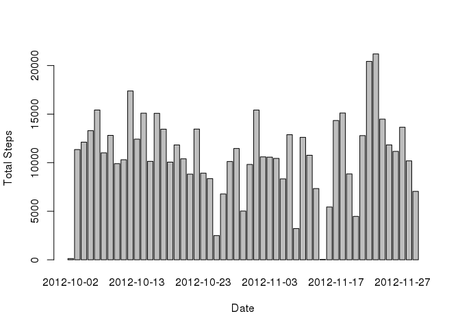
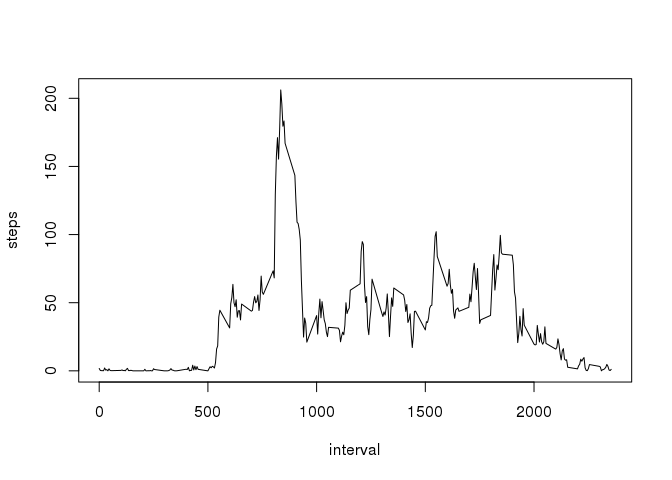
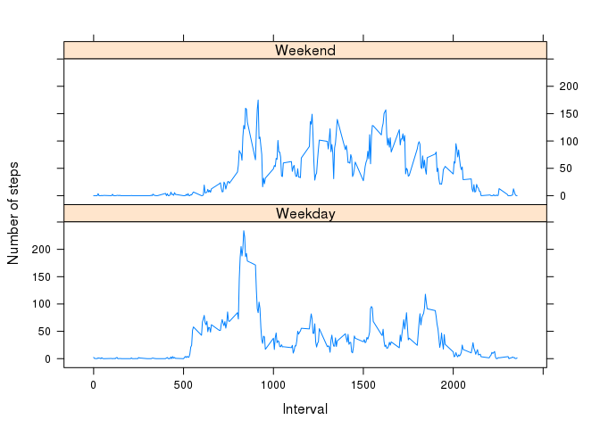

# Reproducible Research: Peer Assessment 1


## Loading and preprocessing the data
Load libraries that will be used


```r
library(reshape2)
library(lattice)
```

Prepare data


```r
# loading the data
if(! file.exists("activity.csv")) 
        unzip(zipfile="activity.zip", exdir=".")

activityData <- read.csv("activity.csv", na.strings = c("NA"))
filteredData <- activityData[!is.na(activityData$steps),]
```

Summarize the filtered data, i.e. no NAs.


```r
summary(filteredData)
```

```
##      steps                date          interval     
##  Min.   :  0.00   2012-10-02:  288   Min.   :   0.0  
##  1st Qu.:  0.00   2012-10-03:  288   1st Qu.: 588.8  
##  Median :  0.00   2012-10-04:  288   Median :1177.5  
##  Mean   : 37.38   2012-10-05:  288   Mean   :1177.5  
##  3rd Qu.: 12.00   2012-10-06:  288   3rd Qu.:1766.2  
##  Max.   :806.00   2012-10-07:  288   Max.   :2355.0  
##                   (Other)   :13536
```


## What is mean total number of steps taken per day?

Aggregate data to just steps per day


```r
totalStepsPerDay <- aggregate(steps ~ date, data = filteredData, FUN=sum)
```

Mean total number of steps taken per day,


```r
mean(totalStepsPerDay$steps)
```

```
## [1] 10766.19
```

Median total number of steps taken per day,


```r
median(totalStepsPerDay$steps) 
```

```
## [1] 10765
```

Build a histogram chart for steps data

```r
barplot(totalStepsPerDay$steps, names.arg=totalStepsPerDay$date, xlab = "Date", ylab = "Total Steps")
```

 

## What is the average daily activity pattern?

Aggregate data to average steps by interval


```r
meanStepsByInterval <- aggregate(steps ~ interval, data=filteredData, FUN=mean)
```

Find the 5-minute interval that on average has the maximum number of steps?


```r
meanStepsByInterval$interval[which.max(meanStepsByInterval$steps)]
```

```
## [1] 835
```

Create time series plot of average number of steps, averaged across all days in 5 minute intervals


```r
plot(meanStepsByInterval, type="l")
```

 

## Imputing missing values

Note that there are a number of days/intervals where there are missing values. The presence of missing days may introduce bias into some calculations or summaries of the data.

Calculate and report the total number of missing values in the dataset


```r
length(activityData$steps) - length(filteredData$steps)
```

```
## [1] 2304
```

Use a merge of the mean steps per day to imput missing values


```r
totalStepsByDate <- aggregate(steps ~ date, data = activityData, FUN=sum)
imputedData <- merge(activityData, totalStepsByDate, by="date", suffixes=c("",".new"))
naSteps <- is.na(imputedData$steps)
imputedData$steps[naSteps] <- imputedData$steps.new[naSteps]
imputedData <- imputedData[,1:3]
totalStepsByDate <- aggregate(steps ~ date, data=imputedData, FUN=sum)
```


Mean for the missing data filled in.


```r
mean(totalStepsByDate$steps)
```

```
## [1] 10766.19
```

Median for missing data filled in.


```r
median(totalStepsByDate$steps)
```

```
## [1] 10765
```

Very little difference between imputed data set and full dataset.  No impact.

Build a histogram chart for steps data

```r
barplot(totalStepsByDate$steps, names.arg=totalStepsByDate$date, xlab="Date", ylab="Total Steps")
```

 

## Are there differences in activity patterns between weekdays and weekends?

Create a new factor variable in the dataset with two levels – “weekday” and “weekend” indicating whether a given date is a weekday or weekend day.


```r
weekPortion <- function(date) {
	if(weekdays(as.Date(date)) %in% c("Saturday", "Sunday")) {
		day <- "Weekend"
	} else {
		day <- "Weekday"
	}
}
imputedData$weekPortion <- as.factor(sapply(imputedData$date, weekPortion))
```

Make a panel plot containing a time series plot (i.e. type = "l") of the 5-minute interval (x-axis) and the average number of steps taken, averaged across all weekday days or weekend days (y-axis)


```r
melted <- melt(imputedData, measure.vars="steps")
meanSteps <- dcast(melted, weekPortion+interval~variable, mean)

xyplot(steps~interval|weekPortion,	data=meanSteps,	xlab="Interval",ylab="Number of steps",	type="l",layout=c(1,2))
```

 
